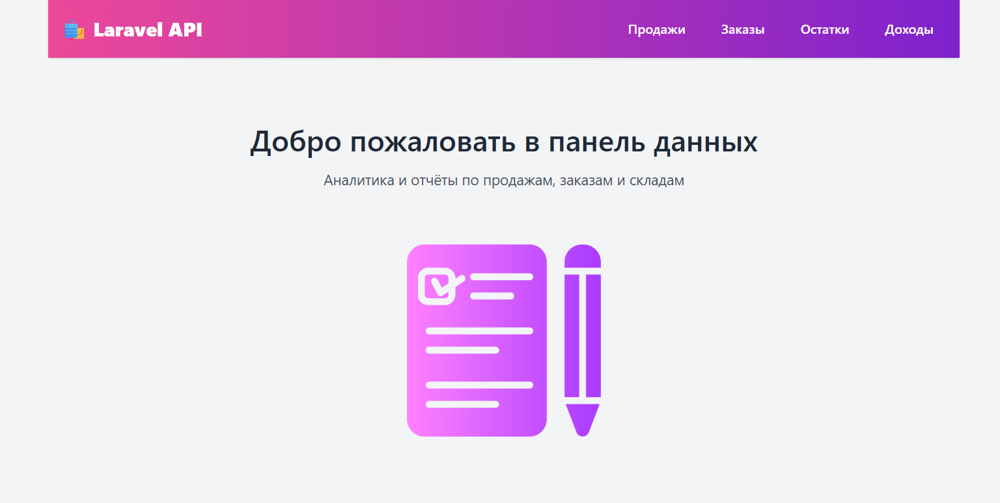

   

 Laravel 
&nbsp;&nbsp;&nbsp;&nbsp;
 MySQL 
&nbsp;&nbsp;&nbsp;&nbsp;
 Blade
&nbsp;&nbsp;&nbsp;&nbsp;
 Tailwind CSS 

   

# 📦 Laravel API: Продажи, Заказы, Склады, Доходы

**Реализация тестового задания.**  

Проект представляет собой REST API, разработанный на Laravel 8, и реализует выдачу данных по четырём сущностям: 
- `sales` — данные о продажах
- `orders` — данные о заказах
- `stocks` — данные об остатках на складе
- `incomes` — данные о доходах

Все эндпоинты возвращают данные в формате JSON с пагинацией.

Полученные данные **собираются с внешнего API** и **сохраняются в базу данных MySQL**, после чего доступны для дальнейшей обработки или отображения.

 

## 🗄️ База данных (MySQL)

Проект использует базу данных **MySQL** для хранения полученных данных из внешнего API. При каждом запуске соответствующей команды данные подгружаются и сохраняются в таблицы:

После всевозможных поисков бесплатных сервисов БД(всевозможные ограничения: многие кстати не дают доступ для подключения и внешки)
Остановил свой выбор БД от Railway(деплой проекта кстати сделан на том же сервисе)

- 🧠 Host: caboose.proxy.rlwy.net
- 🔌 36311
- 📦 Database name: railway
- 👤 Database user: root
- 🔑 Database password: ZfosqYEpTlQBeJcbXZjRjmsCkojidfbY
- 🔐 Protocol: TCP

---

## 🔗 Деплой демонстрационной версии

📍 https://wb-api.artyes.dev/

 

 

## ▶️ Демонстрация artisan-команд

---

## 📬 Работа с Postman

В рамках выполнения тестового задания использовался инструмент **Postman** для тестирования и отладки API-запросов.

⚙️ Ранее опыта работы с Postman не было, однако инструмент оказался интуитивно понятным и удобным — благодаря ему удалось быстро освоить формирование запросов, работу с переменными и тестирование пагинации и авторизации.

📁 В проект включена коллекция запросов Postman, которую можно использовать для быстрого запуска и проверки всех эндпоинтов.

🔗 **Ссылка на коллекцию Postman**: [Postman Collection](https://www.postman.com/cy322666/workspace/app-api-test/overview)
